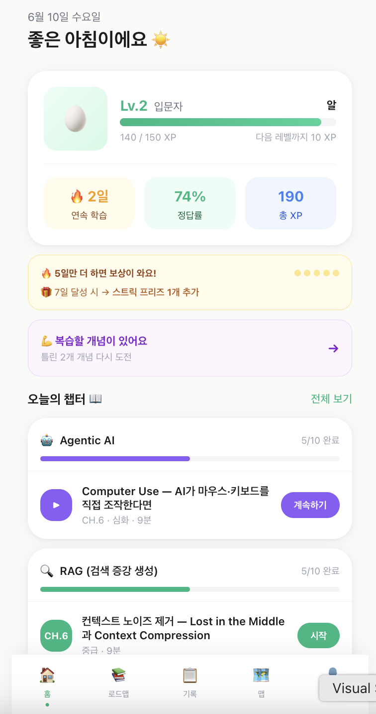
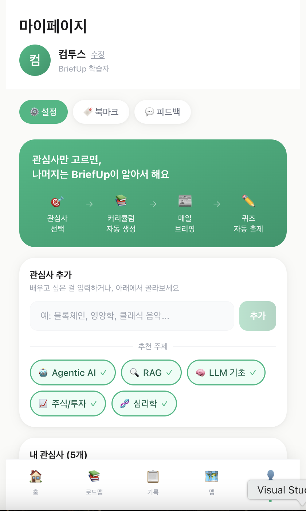
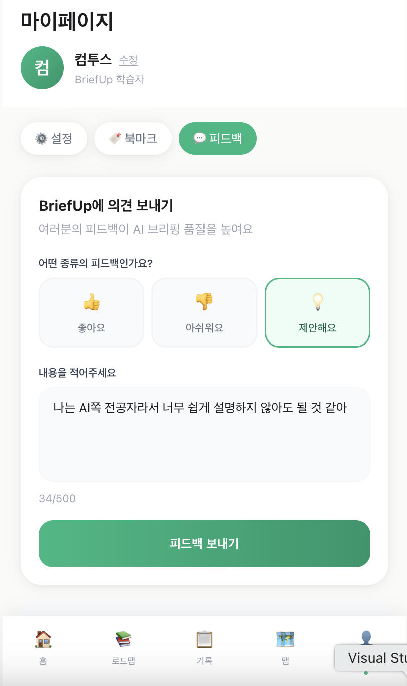
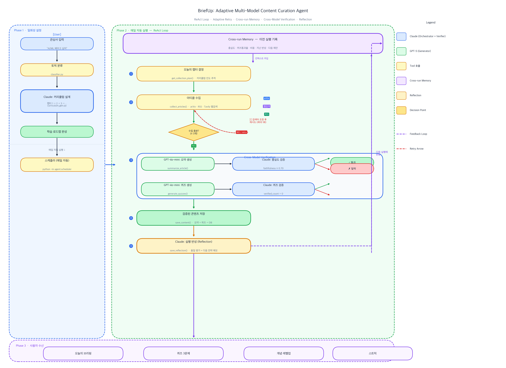

# BriefUp — 개인 학습 Agent

> 관심사를 입력하면 Agent가 커리큘럼을 설계하고, 매일 자료를 수집·요약·퀴즈 생성·검증·Reflection까지 자동으로 수행합니다.

**프로토타입:** https://brief-up.vercel.app  
**소스코드:** https://github.com/gwcat0506/BriefUp  
**백엔드 API:** https://briefup.onrender.com

> ⚠️ Render Free Plan 특성상 첫 접속 시 백엔드 콜드 스타트로 30~60초 지연될 수 있습니다.

---

## 실제 구현 화면

<table>
<tr>
<td align="center"><b>오늘의 학습 현황</b></td>
<td align="center"><b>관심사 설정</b></td>
<td align="center"><b>AI 피드백</b></td>
</tr>
<tr>
<td></td>
<td></td>
<td></td>
</tr>
</table>

---

## 문제 정의 — 반복되는 학습 준비

매일 학습을 시작하려면 항상 같은 일을 반복해야 한다.

- 오늘 뭘 공부할지 정해야 한다 (주제 선정)
- 관련 자료를 찾아야 한다 (자료 탐색)
- 요약하고 퀴즈를 만들어야 한다 (학습 콘텐츠 제작)
- 관심사가 바뀌면 처음부터 다시 설정해야 한다

**결국 공부 자체보다 공부를 준비하는 데 시간이 더 많이 소요된다.**

---

## BriefUp Agent가 하는 일

사용자는 **관심사만 입력**한다. 나머지는 Agent가 처리한다.

```
사용자 입력   →   관심사 (예: Agentic AI, 주식투자, 철학)
Agent 실행   →   Plan → Collect → Generate → Verify → Reflect
사용자 수신   →   오늘의 학습 카드 + 퀴즈 + 커리큘럼 진척도 + 레벨업
```

| 단계 | Agent 역할 |
|------|-----------|
| **Plan** | 관심사에 맞는 12~14챕터 커리큘럼 자동 설계 |
| **Collect** | 챕터별 검색 힌트로 arXiv·RSS·웹에서 최신 자료 수집 |
| **Generate** | GPT-4o-mini로 요약 + 퀴즈 생성 |
| **Verify** | Claude Haiku로 원문 근거 검증 (충실도 ≥ 0.70, 환각 제거) |
| **Reflect** | 실행 품질 평가 + 다음 실행 전략 기록 |

---

## 전체 Agent Workflow



### 3단계 구조

**Phase 1 — 학습 시작하기**  
관심사 입력 → Planning LLM (Claude Haiku) 커리큘럼 설계 → DB 저장  
새 주제 등록 시 1회만 실행. 이후 즉시 파이프라인 백그라운드 실행.

**Phase 2 — 매일 자동 실행 (ReAct Loop)**  
Cross-Run Memory(이전 실행 품질·퀴즈통과율·Reflection)를 주입받아 시작.  
Human Feedback(사용자 난이도/품질 피드백)도 Context Injection으로 반영.

```
get_collection_plan → collect_articles → summarize_article → generate_quizzes → save_content → save_reflection
```

수집이 부족하면(< 3개) 검색어를 조정해 1회 재시도.  
검증 실패 콘텐츠는 저장 없이 폐기. 실행 후 Reflection을 다음 실행에 반영.

**Phase 3 — 사용자 수신**  
오늘의 브리핑 · 퀴즈 3문제 · 개념 레벨업 · 스트릭

---

## 기술적으로 흥미로운 부분 3가지

### 1. Cross-Model Verification — 생성 모델과 검증 모델을 분리

같은 모델이 생성과 검증을 모두 담당하면 blind spot이 겹친다.

```
GPT-4o-mini → 요약 생성 / 퀴즈 생성
                    ↓
Claude Haiku → 충실도 검증 / 퀴즈 검증 (원문 근거 있는가?)
                    ↓
         PASS → DB 저장     FAIL → 폐기
```

검증 기준:
- 원문에 없는 사실·수치가 포함되면 제외
- 퀴즈 정답을 원문에서 찾을 수 없으면 제외
- 단순 암기 형식 ("~의 이름은?") 퀴즈 제외
- JSON 파싱 실패 시 제외 (불확실하면 탈락 원칙)

실제 결과: 생성된 퀴즈의 30~40%만 저장. 엄격한 기준의 의도적 결과.

### 2. 세션 스토어로 원문을 Claude에 숨긴다

```python
# Claude가 받는 것 (토큰 절약)
{"id": "rag_3f8a2c", "title": "RAG Chunking Strategies", "text_length": 4200}

# Python이 보관하는 것 (Claude에 비공개)
{"title": "...", "text": "전체 원문 4200자", "url": "..."}
```

원문을 Claude 컨텍스트에 넣으면 아티클 1개당 2,000~3,000 토큰 소비.  
Claude는 "어떤 아티클을 어떤 순서로 처리할지"만 판단하고, 실제 텍스트 처리는 Python이 담당.

### 3. Cross-Run Memory + Reflection으로 점진적 개선

```
이전 실행:  "철학 토픽 수집량 저조"
→ 다음 실행: "philosophy" 대신 "stoicism", "ethics applied", "philosophy of mind"로 세분화 재시도
```

실행마다 Agent가 품질을 스스로 평가하고 개선 방향을 기록. 다음 실행에 Context Injection으로 반영.

---

## 파이프라인 실제 실행 기록

```
[iteration 1]  get_collection_plan(RAG) → 챕터 3/13: Chunking이 검색 품질을 결정한다
[iteration 2]  collect_articles × 5토픽 동시  (arxiv 4개 + 웹 7개 = 11개 수집)
[iteration 3]  summarize_article × 11개 동시
               [충실도 PASS] rag_a3f2  score=0.95
               [충실도 미달] rag_b8c1  score=0.35  → 스킵
[iteration 4]  generate_quizzes × 통과 아티클
               [PASS] "Chunking 전략 비교" — 원문 근거 명확
               [FAIL] "RAG란 무엇인가?" — 단순 정의 암기 문제
[iteration 5]  save_content × 검증 통과분
[iteration 6]  save_reflection → 다음 실행 전략 기록

비용: ~$0.10 / 실행  |  저장: 3~5개 콘텐츠 + 퀴즈
```

---

## Agent 설계 고려사항

### Verification — 출력 품질 보장
hallucination이 유저에게 전달되는 것을 방지. 검증 오류 시 통과가 아니라 탈락(보수적 처리).

### Observability — 실행 과정 추적
Tool별 호출 순서·소요 시간, 토큰 사용량과 비용, 퀴즈 검증 결과를 `pipeline_runs` 테이블에 기록.  
Render Free 티어의 로그 소실 문제를 DB 영속 로그로 대응.

### Self-Improvement — 이전 실행 결과 반영
실행마다 Reflection 저장 → 다음 실행 시 Cross-Run Memory로 주입 → 수집 전략·쿼리 자동 조정.

---

## 주요 설계 결정

| 결정 | 이유 |
|------|------|
| Claude 오케스트레이션 + GPT 콘텐츠 생성 분리 | 역할별 최적 모델 선택 + blind spot 방지 교차 검증 |
| Claude가 도구를 자율 선택 (ReAct) | 고정 파이프라인은 중간 실패 시 복구 불가 |
| 세션 스토어로 원문 격리 | 원문 노출 시 토큰 비용 폭증 + 할루시네이션 위험 |
| 검증 오류 시 탈락 (통과 아님) | 불확실한 퀴즈가 유저에게 미치는 피해가 더 큼 |
| asyncio.gather 병렬 실행 | 토픽 N개 → N배 빠름 |
| 커리큘럼 DB 캐시 | 동일 토픽 재생성 없이 즉시 반환. 동의어 매칭 지원 |
| 레벨 하락 없음 | 레벨이 떨어지면 좌절 → 이탈. 항상 성장하는 느낌 유지 |
| 스트릭 프리즈 | 하루 빠진 순간 이탈률 급증 (Duolingo 연구 기반) |

---

## 기술 스택

| 파트 | 기술 |
|------|------|
| Frontend | Next.js 14 (App Router), Tailwind CSS, PWA |
| Backend | Python 3.11, FastAPI, asyncio |
| DB | Supabase (PostgreSQL) |
| AI 오케스트레이션 | Claude Haiku 4.5 + FastMCP |
| AI 콘텐츠 생성 | GPT-4o-mini |
| 웹 검색 | Tavily API |
| 배포 | Vercel (프론트) + Render Free (백엔드) |

---

## 현재 구현 범위 (MVP)

**완성된 것**
- AI 에이전트 파이프라인 (커리큘럼 → 수집 → 요약 → 퀴즈 → 검증 → 저장 → Reflection)
- 임의 관심사 추가 → 커리큘럼 자동 생성 → 즉시 파이프라인 실행
- Cross-Run Memory + Human Feedback → 다음 실행 반영
- 브리핑 카드 / 퀴즈 / 로드맵 / 스트릭 / 개념 레벨
- 파이프라인 실행 비용 추적 (Claude + GPT 토큰 → USD)

**향후 과제**
- 모델 조합 최적화 실험 (생성·검증·Planning 모델별 정확도·비용·속도 비교)
- 콘텐츠 품질 정량 측정 (전체 파이프라인 hallucination 비율)
- Tool 기여도 분석 (Tool별 제거 실험으로 품질 영향 측정)
- 일일 자동 스케줄러 (현재는 수동 트리거)
- 사용자 인증 (현재 `TEMP_USER_ID` 하드코딩)

---

## 로컬 실행

```bash
# 백엔드
cd backend
cp .env.example .env        # API 키 입력
pip install -r requirements.txt
uvicorn main:app --reload   # http://localhost:8000

# 파이프라인 수동 실행
python -m agent.scheduler

# 프론트엔드
cd frontend
cp .env.local.example .env.local
npm install
npm run dev                 # http://localhost:3000
```

환경변수: `SUPABASE_URL`, `SUPABASE_SECRET_KEY`, `ANTHROPIC_API_KEY`, `OPENAI_API_KEY`, `TAVILY_API_KEY`
