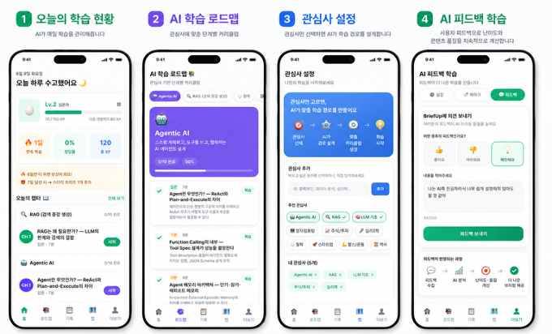
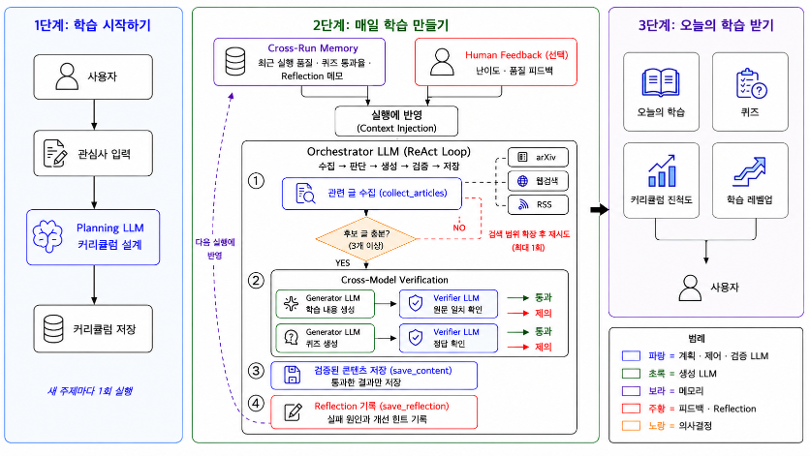

# BriefUp — 개인 학습 Agent

> 관심사를 입력하면 Agent가 커리큘럼을 설계하고, 매일 자료를 수집·요약·퀴즈 생성·검증·Reflection까지 자동으로 수행합니다.

**프로토타입:** https://brief-up.vercel.app &nbsp;|&nbsp; **소스코드:** https://github.com/gwcat0506/BriefUp


> ⚠️ Render Free Plan 특성상 첫 접속 시 백엔드 콜드 스타트로 30~60초 지연될 수 있습니다.

---

## 실제 구현 화면



---

## 문제 정의 — 반복되는 학습 준비

매일 학습을 시작하려면 항상 같은 일을 반복해야 한다.

- 오늘 뭘 공부할지 정해야 한다 (주제 선정)
- 관련 자료를 찾아야 한다 (자료 탐색)
- 요약하고 퀴즈를 만들어야 한다 (학습 콘텐츠 제작)
- 관심사가 바뀌면 처음부터 다시 설정해야 한다

**결국 공부 자체보다 공부를 준비하는 데 시간이 더 많이 소요된다.**

BriefUp은 이 반복을 Agent Workflow로 구조화해 자동으로 처리한다.

---

## BriefUp Agent가 하는 일

사용자는 **관심사만 입력**한다. 나머지는 Agent가 처리한다.

```
사용자 입력   →   관심사 (예: Agentic AI, 주식투자, 철학)
Agent 실행   →   Plan → Collect → Generate → Verify → Reflect
사용자 수신   →   오늘의 학습 카드 + 퀴즈 + 커리큘럼 진척도 + 레벨업
```

| 단계 | Agent 역할 |
|------|-----------|
| **Plan** | 관심사에 맞는 12~14챕터 커리큘럼 자동 설계 |
| **Collect** | 챕터별 검색 힌트로 arXiv·RSS·웹에서 최신 자료 수집 |
| **Generate** | GPT-4o-mini로 요약 + 퀴즈 생성 |
| **Verify** | Claude Haiku로 원문 근거 검증 (Faithfulness ≥ 0.70, hallucination 제거) |
| **Reflect** | 실행 품질 평가 + 다음 실행 전략 기록 |

---

## 전체 Agent Workflow



**Phase 1 — 학습 시작하기**  
관심사 입력 → Planning LLM (Claude Haiku) 커리큘럼 설계 → DB 저장  
새 주제 등록 시 1회만 실행. 이후 즉시 파이프라인 백그라운드 실행.

**Phase 2 — 매일 자동 실행 (ReAct Loop)**  
Cross-Run Memory(이전 실행 품질·퀴즈통과율·Reflection)를 주입받아 시작.  
Human Feedback(사용자 난이도/품질 피드백)도 Context Injection으로 반영.

```
get_collection_plan → collect_articles → summarize_article → generate_quizzes → save_content → save_reflection
```

수집이 부족하면(< 3개) 검색어를 조정해 1회 재시도.  
검증 실패 콘텐츠는 저장 없이 폐기. 실행 후 Reflection을 다음 실행에 반영.

**Phase 3 — 사용자 수신**  
오늘의 브리핑 · 퀴즈 3문제 · 개념 레벨업 · 스트릭

---

## 단순 파이프라인이 아닌 이유 — Agent의 자율 판단

고정된 함수 호출 순서가 아니다. Claude Haiku가 중간 결과를 보고 다음 행동을 직접 판단한다.

| 상황 | Claude의 자율 결정 |
|------|------------------|
| 수집된 아티클이 토픽과 무관함 | 요약 없이 건너뜀 |
| Faithfulness score < 0.70 | 퀴즈 생성 없이 탈락 처리 |
| 수집 결과 < 3개 (`needs_retry=true`) | 더 넓은 쿼리로 1회 재시도 |
| `verified_count = 0` | `save_content` 호출 자체를 하지 않음 |
| 이전 실행에서 수집량 저조 기록됨 | 다음 실행에서 하위 쿼리를 세분화해 재시도 |

오류가 발생해도 해당 아티클·토픽만 건너뛰고 나머지는 계속 처리한다.

---

## 모델 역할 분리

두 모델이 명확히 역할을 나눈다. GPT가 생성한 것을 Claude가 검증 — 같은 모델이 생성·검증하면 blind spot이 겹치기 때문이다.

| 역할 | 모델 |
|------|------|
| 오케스트레이션 (ReAct Loop) | Claude Haiku 4.5 |
| 커리큘럼 설계 (Planning) | Claude Haiku 4.5 |
| Faithfulness 검증 / Quiz 검증 (Verifier) | Claude Haiku 4.5 |
| 요약 생성 (Generator) | GPT-4o-mini |
| 퀴즈 생성 (Generator) | GPT-4o-mini |

---

## Cross-Model Verification — 검증 기준 상세

### Faithfulness 검증 (요약문 → 원문 근거 확인)

```
GPT-4o-mini가 생성한 요약을 Claude Haiku가 원문과 대조 검증
→ score 0.0~1.0 + 문제 항목 반환
→ score < 0.70 이면 해당 아티클 전체 폐기 (퀴즈 생성 없이 드롭)
```

**PASS 조건 (모두 충족해야 함)**
1. 요약문의 모든 주장을 원문에서 직접 근거를 찾을 수 있는가?
2. 원문에 없는 외부 지식이나 추론을 추가하지 않았는가?
3. 원문의 수치·사실을 왜곡하거나 과장하지 않았는가?

**FAIL 조건 (하나라도 해당하면 즉시 탈락)**
- 원문에 없는 사실, 수치, 이름이 등장함
- 원문의 결론과 반대되는 주장이 있음
- 원문에 없는 비교나 인과관계를 추가함

---

### Quiz 검증 (생성된 퀴즈 → 품질 확인)

```
GPT-4o-mini가 생성한 퀴즈를 Claude Haiku가 원문 기준으로 재검증
→ PASS / FAIL 판정 + 판단 근거 한 문장 반환
```

**PASS 조건 (모두 충족해야 함)**
1. 정답이 원문에서 명확히 근거를 찾을 수 있는가?
2. 오답 보기들이 그럴듯하지만 원문 기준으로 틀린 내용인가? (명백히 틀린 보기는 감점)
3. 해설이 원문 내용과 일치하며 오답 이유도 설명하는가?
4. 보기 4개가 실질적으로 구분 가능한가?

**FAIL 조건 (하나라도 해당하면 즉시 탈락)**
- 정답 근거를 원문에서 찾을 수 없음
- 단순 정의 암기 형식 — "~의 이름은?", "~란 무엇인가?" 형식
- 오답 보기 중 명백히 말이 안 되는 것이 포함됨 (함정이 너무 쉬움)
- 보기 4개 중 실질적으로 구분이 안 되는 보기가 있음

---

### 보수적 실패 원칙

> **"불확실하면 탈락"** — 검증 오류(JSON 파싱 실패, API 오류 등) 발생 시 통과가 아니라 탈락 처리

품질이 불확실한 콘텐츠가 유저에게 전달되는 것이 더 큰 피해라고 판단했기 때문이다.  
실제 퀴즈 검증 통과율 **30~40%** — 낮은 수치가 아니라 엄격한 기준의 의도적 결과다.

---

## FastMCP 도구 구성

Claude가 자율 선택하는 도구 6개를 `@mcp.tool()` 데코레이터로 선언적으로 관리한다.

| 도구 | 역할 |
|------|------|
| `get_active_topics` | DB에서 활성 토픽 목록 조회 |
| `get_collection_plan` | 커리큘럼 진도 기반 오늘 챕터 + 검색 쿼리 결정 |
| `collect_articles` | arXiv / RSS / Tavily 웹검색으로 자료 수집 |
| `summarize_article` | GPT-4o-mini 요약 → Claude Faithfulness 검증 |
| `generate_quizzes` | GPT-4o-mini 퀴즈 생성 → Claude 교차 검증 |
| `save_content` | 검증 통과한 콘텐츠·퀴즈를 Supabase에 저장 |

`get_collection_plan`은 `len(기수집 날짜) % len(챕터 목록)`으로 오늘 챕터를 결정한다.  
수집이 쌓일수록 자동으로 다음 챕터로 진행하며, 전체 챕터를 순환한다.

---

## 실제 실행 결과

```
[iteration 1]  get_collection_plan(RAG) → 챕터 3/13: Chunking이 검색 품질을 결정한다
[iteration 2]  collect_articles × 5토픽 동시  (arxiv 4개 + 웹 7개 = 11개 수집)
[iteration 3]  summarize_article × 11개 동시
               [Faithfulness PASS] rag_a3f2  score=0.95
               [Faithfulness FAIL] rag_b8c1  score=0.35  → 드롭
[iteration 4]  generate_quizzes × 통과 아티클
               [Quiz PASS] "Chunking 전략 비교" — 원문 근거 명확
               [Quiz FAIL] "RAG란 무엇인가?" — 단순 정의 암기 문제
[iteration 5]  save_content × 검증 통과분
[iteration 6]  save_reflection → 다음 실행 전략 기록
```

| 지표 | 실측값 |
|------|-------|
| Faithfulness avg | 0.95 |
| Quiz 검증 통과율 | 30~40% (엄격한 기준 의도적 유지) |
| 저장 콘텐츠 | 3~5개 / 실행 |
| 실행 비용 | ~$0.10 / 실행 |
| 병렬 처리 | asyncio.gather — 토픽 N개 동시 실행 |

---

## 설계 고려사항

### Observability — 실행 과정 추적
Tool별 호출 순서·토큰 사용량·비용·퀴즈 검증 결과를 `pipeline_runs` 테이블에 기록.  
Render Free 티어의 로그 소실 문제를 DB 영속 로그로 대응.

### Self-Improvement — 이전 실행 결과 반영
실행마다 Reflection 저장 → 다음 실행 시 Cross-Run Memory로 주입 → 수집 전략·쿼리 자동 조정.

```
이전 실행:  "철학 토픽 수집량 저조"
→ 다음 실행: "philosophy" 대신 "stoicism", "ethics applied", "philosophy of mind"로 세분화 재시도
```

### Session Store — 원문을 Claude에 숨긴다
원문을 Claude 컨텍스트에 넣으면 아티클 1개당 2,000~3,000 토큰 소비.  
대신 Python `_session`에만 원문을 보관하고 Claude에는 `article_id + 메타데이터`만 노출한다.

```python
# Claude가 받는 것 (토큰 절약)
{"id": "rag_3f8a2c", "title": "RAG Chunking Strategies", "text_length": 4200}

# Python이 보관하는 것 (Claude에 비공개)
{"title": "...", "text": "전체 원문 4200자", "url": "..."}
```

Claude는 "어떤 아티클을 어떤 순서로 처리할지"만 판단하고, 실제 텍스트 처리는 Python이 담당.

---

## 기술 스택

| Category | Tech |
|----------|------|
| Frontend | Next.js / TypeScript / Vercel |
| Backend | FastAPI / Python / Render |
| Database | Supabase / PostgreSQL |
| Agent | Claude + FastMCP |

---

## 현재 구현 범위 (MVP)

**완성된 것**
- AI 에이전트 파이프라인 (커리큘럼 → 수집 → 요약 → 퀴즈 → 검증 → 저장 → Reflection)
- 임의 관심사 추가 → 커리큘럼 자동 생성 → 즉시 파이프라인 실행
- Cross-Run Memory + Human Feedback → 다음 실행 반영
- 브리핑 카드 / 퀴즈 / 로드맵 / 스트릭 / 개념 레벨
- 파이프라인 실행 비용 추적 (Claude + GPT 토큰 → USD)

**향후 과제**
- 모델 조합 최적화 실험 (생성·검증·Planning 모델별 정확도·비용·속도 비교)
- 콘텐츠 품질 정량 측정 (전체 파이프라인 hallucination 비율)
- Tool 기여도 분석 (Tool별 제거 실험으로 품질 영향 측정)
- 일일 자동 스케줄러 (현재는 수동 트리거)
- 사용자 인증 (현재 `TEMP_USER_ID` 하드코딩)

---

## 로컬 실행

```bash
# 백엔드
cd backend
cp .env.example .env        # API 키 입력
pip install -r requirements.txt
uvicorn main:app --reload   # http://localhost:8000

# 파이프라인 수동 실행
python -m agent.scheduler

# 프론트엔드
cd frontend
cp .env.local.example .env.local
npm install
npm run dev                 # http://localhost:3000
```

환경변수: `SUPABASE_URL`, `SUPABASE_SECRET_KEY`, `ANTHROPIC_API_KEY`, `OPENAI_API_KEY`, `TAVILY_API_KEY`
